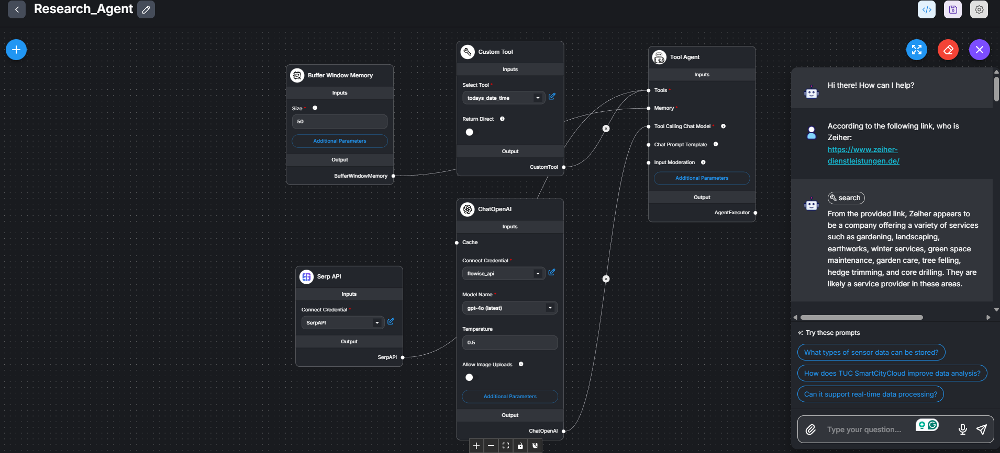
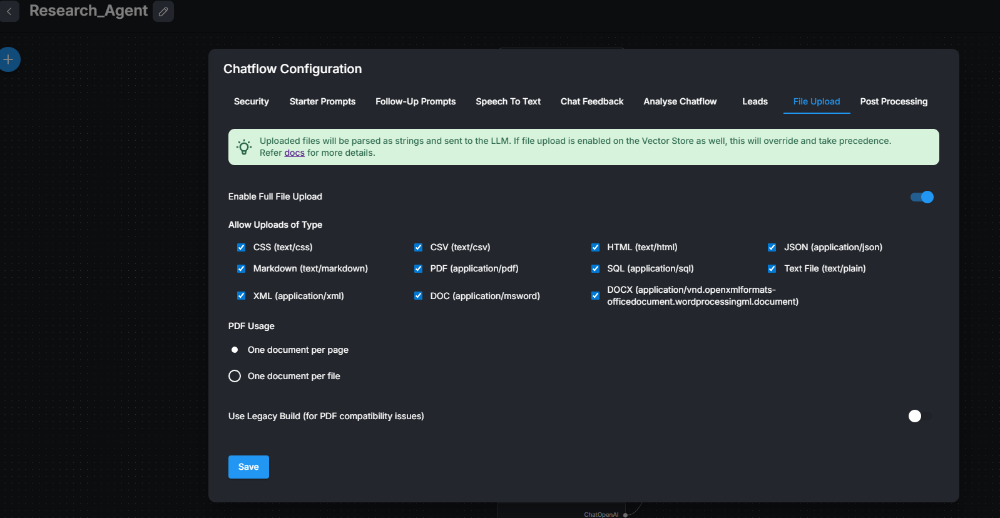
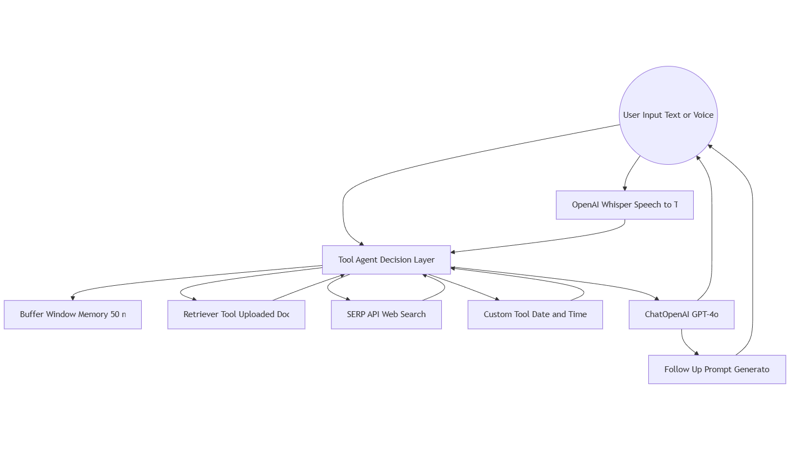

# 🧠 Research Agent

> AI-Powered Document & Web Research Assistant (Low/No-Code, Production-Ready)

## 📋 Table of Contents

- [Overview](#-overview)
- [🚀 Try It Out](#-try-it-out)
- [� Screenshots](#-screenshots)
- [�🚀 Key Capabilities](#-key-capabilities)
- [🧩 Architecture](#-architecture)
- [🧠 How It Works](#-how-it-works)
- [📂 File Upload Support](#-file-upload-support)
- [🎯 Use Cases](#-use-cases)
- [🛠️ Technology Stack](#️-technology-stack)
- [🔑 Skills Demonstrated](#-skills-demonstrated)
- [🏁 Summary](#-summary)

## 📖 Overview

Research Agent is a **production-ready AI research assistant** built with Flowise (low/no-code) that enables users to chat or speak directly with their documents and web data.

It combines **Retrieval-Augmented Generation (RAG)**, tool-based LLM agents, vector-style document retrieval, live web search, speech-to-text, and contextual memory to deliver accurate, grounded, and explainable answers.

This project demonstrates how modern AI systems can be designed and deployed **without traditional coding**, while still meeting production, scalability, and reliability standards expected in real-world applications.

## 🚀 Try It Out

🔗 **[Try the Research Agent Live](https://flowiseai-automate.onrender.com/chatbot/49488d60-916c-4b7a-9b21-e4eefef174e5)** - Experience the AI research assistant in action!

## � Screenshots

### Chat Interface

*The main chat interface showing the conversational AI research assistant with document upload and web search capabilities.*

### File Upload Configuration

*Configuration interface for uploading and processing various document types.*

## �🚀 Key Capabilities

- **Retrieval-Augmented Generation (RAG)** - Grounded responses from document data
- **Tool-based LLM Agents** - Intelligent decision-making and tool orchestration
- **Document & Knowledge Base Q&A** - Semantic search across uploaded files
- **Web & Link-Aware Research** - Live web search via SERP API integration
- **Speech-to-Text (Voice AI)** - OpenAI Whisper-powered voice input
- **Contextual Memory** - Multi-turn reasoning and conversation history
- **Automated Follow-up Prompts** - GPT-4o-mini generated relevant questions
- **No-Code AI Orchestration** - Visual workflow design with Flowise
- **Production-Ready Architecture** - Scalable, reliable AI system design

## 🧩 Architecture

The Research Agent is composed of modular AI components orchestrated visually using Flowise.

🔷 Architecture Diagram

## 🧠 How It Works

### User Interface

*The intuitive chat interface allows users to ask questions naturally and receive AI-powered research assistance.*

### User Input
Users can **type questions** or **speak directly** to the agent. Voice input is transcribed using OpenAI Whisper.

### Tool Agent (Core Intelligence)
Acts as the brain of the system. Intelligently decides whether to:

- Retrieve information from uploaded documents
- Search the web via SERP API
- Use a custom date/time tool
- Answer directly using the LLM

### Retrieval-Augmented Generation (RAG)
- Uploaded documents are searched semantically via the Retriever Tool
- Relevant content is injected into the LLM context
- Responses are grounded in real data, reducing hallucinations

### Live Web Research

- URLs and external questions are handled using the SERP API Tool
- Enables up-to-date, factual research beyond static documents

### LLM Reasoning & Response
- GPT-4o performs reasoning and answer generation
- Responses are contextual, explainable, and tool-aware

### Follow-Up Prompt Generation
- GPT-4o-mini generates short, relevant follow-up questions
- Improves user engagement and research flow

## 📂 File Upload Support

Users can upload and interact with **structured and unstructured data**.

### File Upload Interface

*Easy-to-use interface for uploading documents and configuring file processing.*

### Supported File Types
- PDF
- DOC / DOCX
- TXT
- Markdown
- CSV

- JSON
- XML
- HTML
- CSS
- SQL

### File Handling Principles
- Uploaded files are treated as **primary knowledge sources**
- One document per file (PDF: one document per page)
- The agent does **not hallucinate** missing content
- If information is unavailable, it is stated clearly

## 🎯 Use Cases

- **Academic & technical research** - Deep analysis of research papers and technical documentation
- **Policy and compliance analysis** - Review and analyze regulatory documents and policies
- **Market & competitive intelligence** - Gather and analyze market data and competitor information
- **Document summarization and analysis** - Extract key insights from large documents
- **Voice-driven knowledge exploration** - Hands-free research and analysis
- **AI-assisted data understanding** - Interactive exploration of complex datasets

## 🛠️ Technology Stack

| Category | Technology |
|----------|------------|
| AI Orchestration | Flowise (Low/No-Code) |
| LLM | OpenAI GPT-4o |
| Follow-Up Prompts | GPT-4o-mini |
| Retrieval | Retriever Tool (RAG) |
| Web Search | SERP API |
| Memory | Buffer Window Memory |
| Speech-to-Text | OpenAI Whisper |
| File Handling | Full File Uploads |

## 🔑 Skills Demonstrated

- **Retrieval-Augmented Generation (RAG)** - Advanced knowledge grounding techniques
- **AI Agents & Tool-Based Reasoning** - Autonomous agent development and orchestration
- **Conversational AI Systems** - Natural language interfaces and dialogue management
- **Vector-Style Semantic Retrieval** - Efficient document indexing and search
- **Low/No-Code AI Architecture** - Visual programming and workflow design
- **Speech-to-Text Integration** - Voice input processing and transcription
- **Production AI System Design** - Scalable, reliable AI application architecture
- **Human-in-the-Loop Research UX** - Interactive research interfaces and user experience
- **LLM Prompt & Agent Design** - Advanced prompting strategies and agent engineering

## ## 🏁 Summary

Research Agent showcases the ability to design and deploy modern AI systems that combine:

- **LLM reasoning** - Advanced language model capabilities
- **Retrieval-based knowledge grounding** - Accurate, factual responses
- **Tool orchestration** - Intelligent agent behavior and decision-making
- **Voice interaction** - Natural speech interfaces
- **Real-world usability** - Production-ready user experience

All achieved using **no-code orchestration**, proving that strong AI architecture and system thinking matter more than raw coding alone.